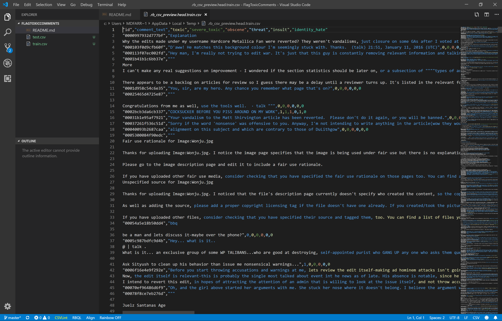

# The case

Online discussions about things you care about can be difficult. The threat of abuse and harassment means that many people stop expressing themselves and give up on seeking different opinions. Many platforms struggle to effectively facilitate conversations, leading many communities to limit or completely shut down user comments.

The Conversation AI team, a research initiative founded by Jigsaw and Google are working on tools to help improve online conversation. One area of focus is the study of negative online behaviors, like toxic comments that are rude, disrespectful or likely to make someone leave a discussion. 

They have built a range of public tools to detect toxicity. But the current apps still make errors, and they don’t allow users to select which types of toxicity they’re interested in finding.

In this case study, you’re going to build an app that is capable of detecting different types of of toxicity like threats, obscenity, insults, and identity-based hate. You’ll be using a dataset of comments from Wikipedia’s talk page edits.

How accurate will your app be? Do you think you will be able to flag every toxic comment? 

That's for you to find out! 

# The dataset



In this case study you'll be working with a dataset containing over 313,000 comments from Wikipedia talk pages. 

There are two files in the dataset:
* [train.csv](https://www.kaggle.com/c/jigsaw-toxic-comment-classification-challenge/download/train.csv) which contains 160k records, 2 input features, and 6 output labels. You will use this file to train your model.
* [test.csv](https://www.kaggle.com/c/jigsaw-toxic-comment-classification-challenge/download/test.csv) which contains 153k records and 2 input features. You will use this file to test your model.

You'll need to [download the dataset from Kaggle](https://www.kaggle.com/c/8076/download-all) to get started. [Create a Kaggle account](https://www.kaggle.com/account/login) if you don't have one yet. 

Here's a description of all columns in the training file:
* **id**: the identifier of the comment
* **comment_text**: the text of the comment
* **toxic**: 1 if the comment is toxic, 0 if it is not
* **severe_toxic**: 1 if the comment is severely toxic, 0 if it is not
* **obscene**: 1 if the comment is obscene, 0 if it is not
* **threat**: 1 if the comment is threatening, 0 if it is not
* **insult**: 1 if the comment is insulting, 0 if it is not
* **identity_hate**: 1 if the comment represents identity hatred, 0 if it does not

# Getting started
Go to the console and set up a new console application:

```bash
$ dotnet new console -o FlagToxicComments
$ cd FlagToxicComments
```

Then install the ML.NET NuGet package:

```bash
$ dotnet add package Microsoft.ML
$ dotnet add package Microsoft.ML.FastTree
```

And launch the Visual Studio Code editor:

```bash
$ code .
```

The rest is up to you! 

# Hint
To process text data, you'll need to add a **FeaturizeText** component to your machine learning pipeline. 

Your code should look something like this:

```csharp
// assume we have a partial pipeline in the variable 'partialPipe'

// add a text featurizer to the pipeline. It will read the 'CommentText' column,
// transform the text to a numeric vector and store it in the 'Features' column
var completePipe = partialPipe.Append(context.Transforms.Text.FeaturizeText(
    outputColumnName: "Features",
    inputColumnName: "CommentText"))
```

FeaturizeText is a handy all-in-one component that can read text columns, process them, and convert them to numeric vectors 
that are ready for model training. 

# Your assignment
I want you to build an app that reads the training and testing files in memory and featurizes the comments to prepare them for analysis.

Then train a multiclass classifier on the training data and generate predictions for the comments in the testing file. 

Measure the micro- and macro accuracy. Report your best values in our group.

See if you can get the accuracies as close to 1 as possible. Share in our group how you did it. Which learning algorithm did you select, and how did you configure your model? 

Good luck!